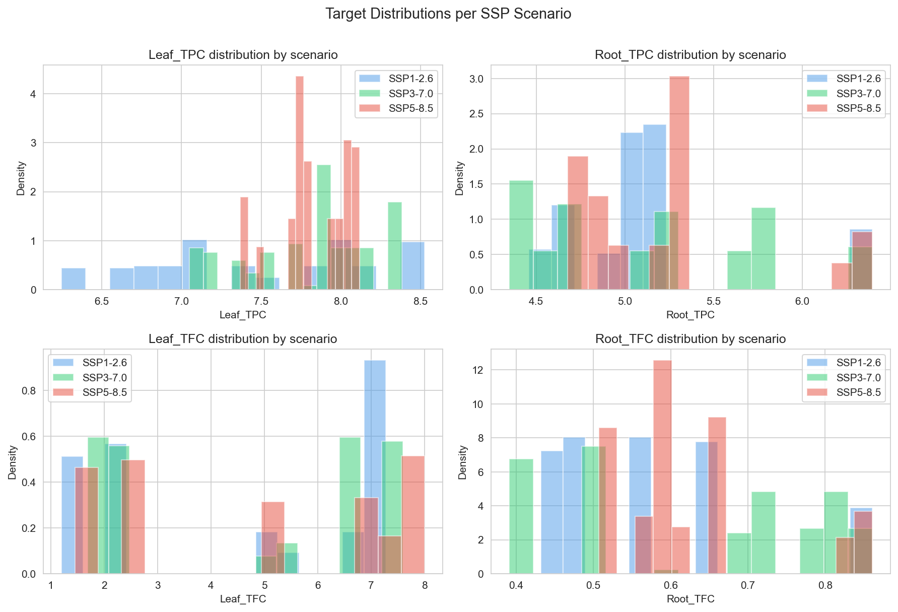
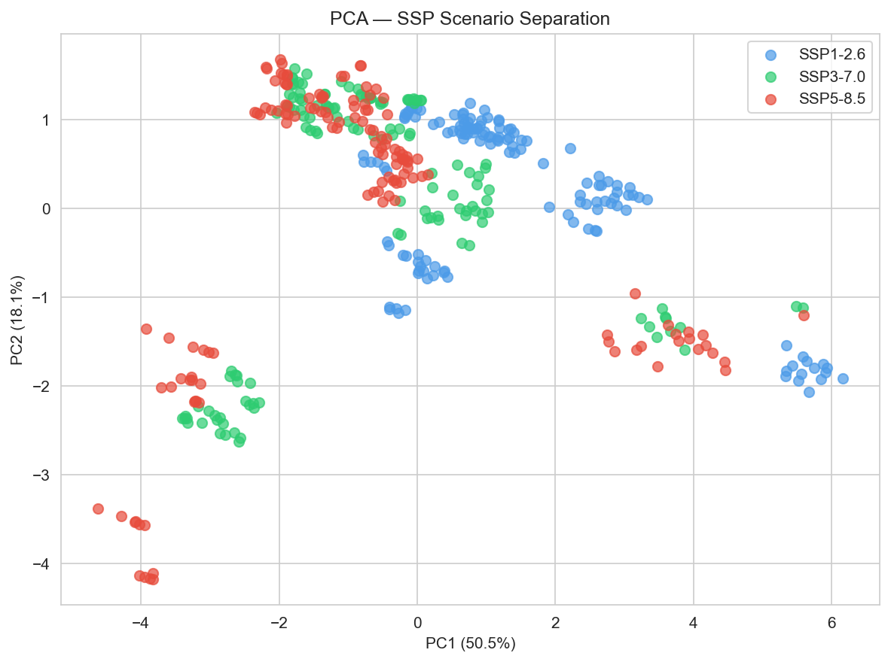
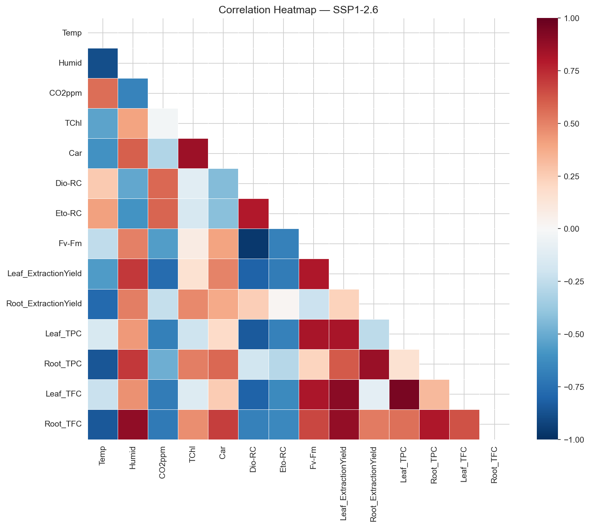
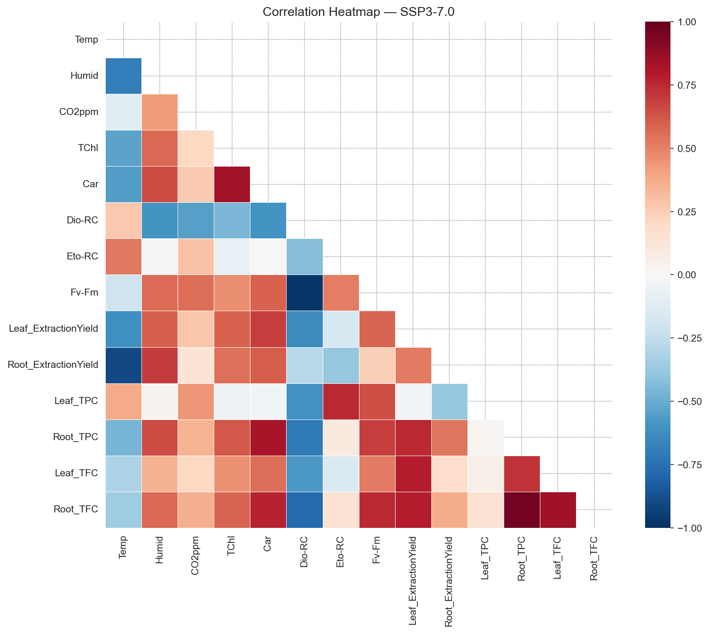
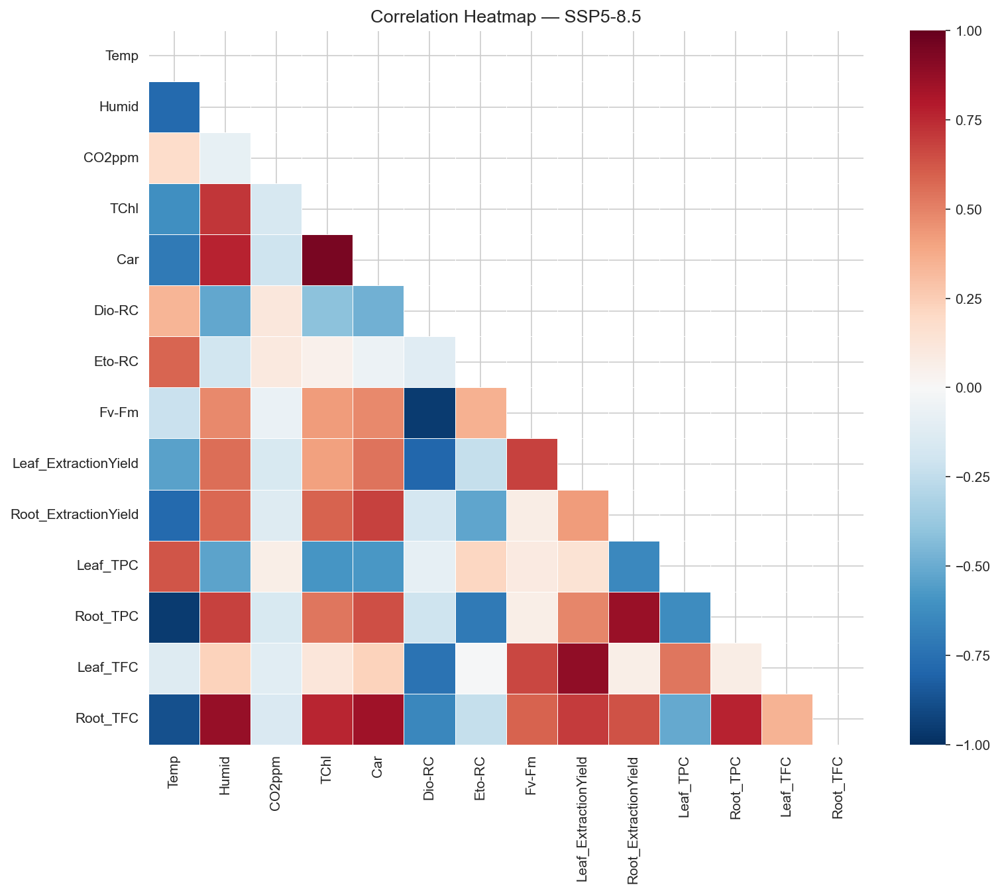
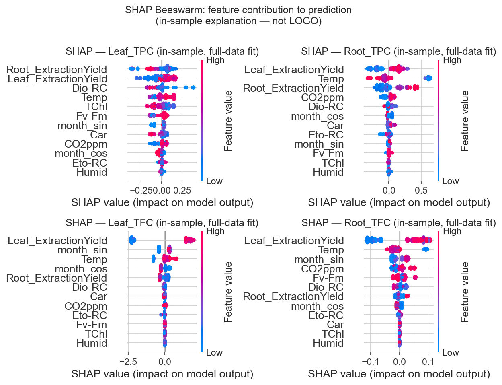
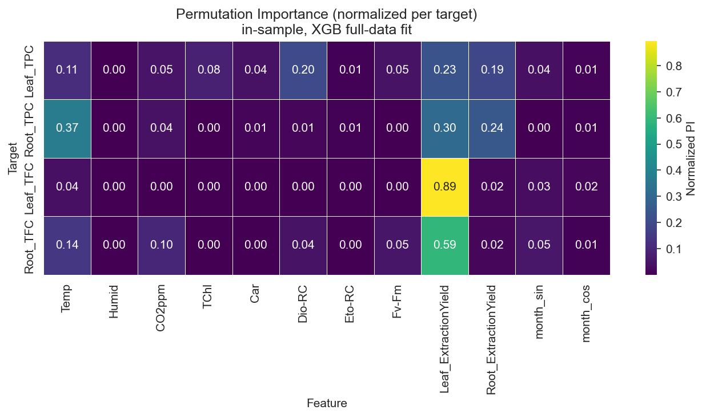
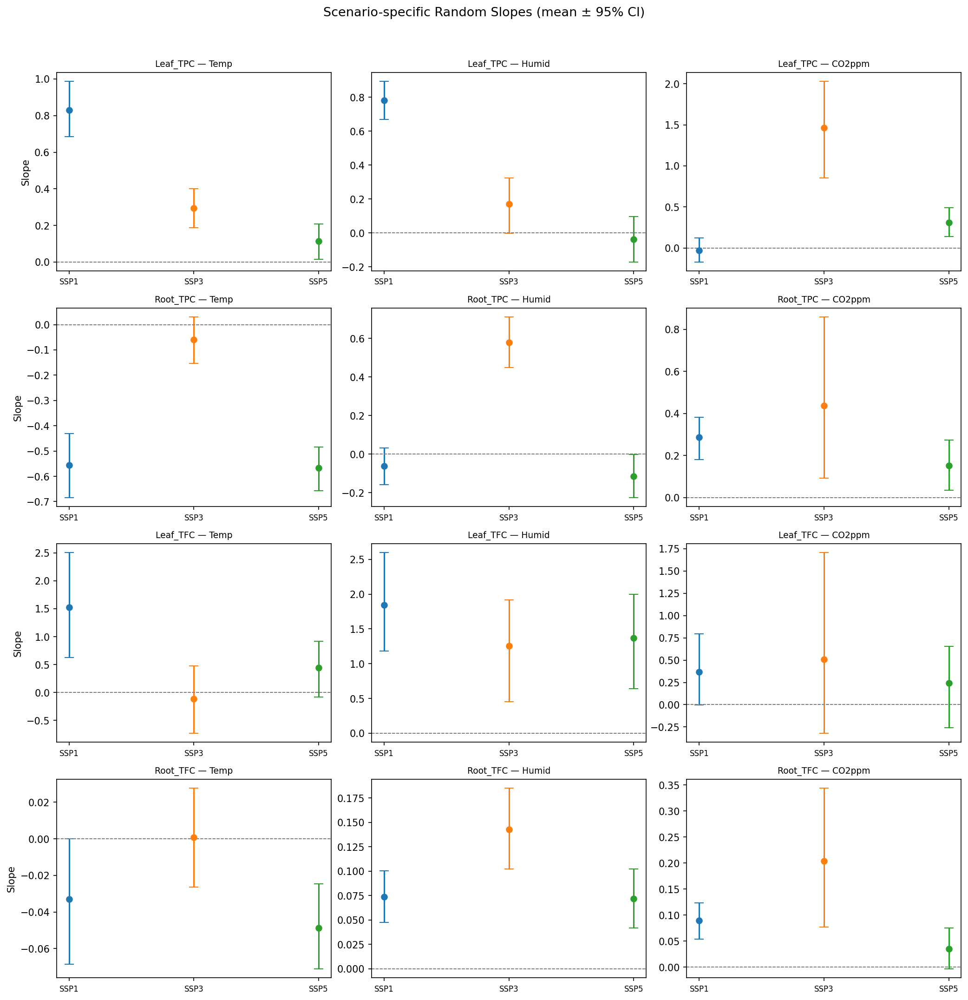

# Climate-Smart Crop Modeling: Predicting Bioactive Compounds in *Cnidium officinale* under SSP Climate Scenarios

**2025 KISTI DATA·AI Analysis Competition**

A machine learning study on how climate change scenarios (SSP1-2.6 / SSP3-7.0 / SSP5-8.5) alter the bioactive compound content (Total Phenolic Content, Total Flavonoid Content) of medicinal crop *Cnidium officinale* (천궁), with a focus on **scenario-level generalization** and **interpretable causal analysis**.

---

## Research Question

> *Can a machine learning model trained on two climate scenarios reliably predict bioactive compound levels in a completely unseen third scenario — and what environmental factors drive these changes?*

Standard crop models optimize for within-sample accuracy. This project is designed around a harder, more realistic objective: **scenario extrapolation**. Models are evaluated using **Leave-One-Group-Out (LOGO) cross-validation** at the SSP scenario level, simulating the challenge of predicting under genuinely novel future climate conditions.

---

## Background

*Cnidium officinale* is a high-value medicinal crop used in traditional medicine, functional foods, and pharmaceutical ingredients. Its bioactive quality is sensitive to environmental stress — yet most agricultural AI focuses on yield, not compound stability.

| Scenario | Description | CO₂ by 2100 |
|---|---|---|
| SSP1-2.6 | Sustainable growth, low emissions | 432 ppm |
| SSP3-7.0 | Fragmented policy, high vulnerability | 834 ppm |
| SSP5-8.5 | Fossil-fuel intensive, urban-led development | 1,089 ppm |

This framing connects directly to climate impact assessment under IPCC's Shared Socioeconomic Pathways — the same framework used in integrated assessment modeling (IAM) research.

---

## Repository Structure

```
├── notebooks/
│   ├── 01_eda_correlation.ipynb        # EDA: distribution, correlation, PCA
│   ├── 02_baseline_regression.ipynb    # Linear, Ridge, Lasso, ElasticNet, PLS
│   ├── 03_baseline_tree.ipynb          # RandomForest, XGBoost + tuning
│   ├── 04_final_model_blend.ipynb      # Blending + linear calibration + SHAP
│   └── 05_bayesian_hierarchical.ipynb  # PyMC Bayesian hierarchical model
├── docs/
│   ├── interim_presentation.pdf        # Mid-project EDA & baseline results
│   └── final_report.pdf
└── data/
    └── README.md                       # Data description (raw data not included)
```

---

## Data

Data collected from **SPDS (Soil Plant Daylit System) chambers** at three SSP-simulated climate conditions.

| Category | Variables |
|---|---|
| Environmental | Temperature, Humidity, VPD, CO₂ppm, PAR, Rainfall |
| Physiological (chlorophyll/pigment) | Chl_a, Chl_b, TChl, Car, Chl_a_b, TCh-Car |
| Physiological (photosynthesis efficiency) | Fv/Fm, PI_abs, SFI_abs, DF_abs |
| Photosystem reaction center | ABS-RC, Tro-RC, Dio-RC, Eto-RC |
| Extraction yield | Leaf_ExtractionYield, Root_ExtractionYield |
| **Target variables** | **Leaf_TPC, Root_TPC, Leaf_TFC, Root_TFC** |

> Raw data provided by the competition organizers and cannot be publicly shared. All code is available for reproducibility.

---

## Methodology

### Pipeline

```
Raw Data
   │
   ├─ EDA
   │    ├─ Scenario-stratified distribution analysis (ANOVA, Kruskal-Wallis)
   │    ├─ Correlation heatmaps per SSP scenario (SSP1 / SSP3 / SSP5)
   │    └─ PCA: SSP1 ↔ SSP5 separation on photosynthesis + seasonality axis (PC1: 53%)
   │
   ├─ Preprocessing
   │    ├─ No missing values; outlier clipping via IQR (Chl_a_b selective)
   │    ├─ VIF-based multicollinearity reduction (target VIF < 10; 8 variables removed)
   │    ├─ RobustScaler (robust to extreme values under SSP5 stress conditions)
   │    └─ Month cyclical encoding — sin/cos transformation (captures seasonality continuously)
   │
   ├─ Baseline Modeling
   │    ├─ Regression: Linear, Ridge, Lasso, ElasticNet, PLS2/PLS3
   │    └─ Tree: RandomForest, XGBoost (RandomizedSearch → fine-grained tuning)
   │
   ├─ Final Model
   │    ├─ Blend: XGB(0.55) + Ridge(0.45) — OOF weight optimization
   │    ├─ Linear Calibration — corrects scale/offset mismatch per scenario × target
   │    └─ Interpretation: SHAP (beeswarm) + Permutation Importance
   │         (both computed on full-data fit; LOGO-based SHAP was computationally
   │          prohibitive given per-fold retraining costs)
   │
   └─ Bayesian Hierarchical Model (PyMC)
        ├─ Random slopes for Temp, Humid, CO₂ per SSP scenario
        └─ Reports effect direction + 95% CI per scenario (WAIC/LOO for fit assessment)
```

### Validation Strategy: Scenario-Level LOGO

Standard K-Fold cross-validation does not simulate a realistic climate adaptation problem — it leaks scenario-level information into training. This project uses **Leave-One-Group-Out (LOGO)** where each SSP scenario is entirely withheld as a test set in turn.

This tests the harder question: *can the model extrapolate to a climate it has never seen?*

---

## Modeling Decisions

This project went through two distinct phases. The mid-project analysis (documented in [`docs/interim_presentation.pdf`](docs/interim_presentation.pdf)) explored a broader candidate set before converging on the final pipeline. Key decisions made along the way:

**Why not CatBoost?**
CatBoost was evaluated as a final model candidate alongside XGBoost and Ridge. Under LOGO validation, CatBoost showed higher variance across SSP scenarios (average R² 0.615) compared to the XGB+Ridge blend, and offered no consistent advantage that justified the added complexity.

**Why blend XGB and Ridge instead of a single model?**
XGBoost generalized well to SSP5 but was unstable on SSP3. Ridge was the opposite — strong on SSP3 but weaker on SSP5. Blending the two (OOF-optimized weight: XGB 0.55, Ridge 0.45) produced more consistent performance across all three scenarios than either model alone.

**Why add linear calibration?**
Raw blend predictions showed systematic scale and offset mismatch per scenario × target combination — a pattern visible in the Pearson r vs. R² gap in diagnostic checks. A simple per-combination linear correction (ŷ → aŷ + b) resolved this without introducing additional model complexity.

**Why use LOGO over K-Fold?**
Scenario-level distribution shift (confirmed by ANOVA and PCA) means K-Fold cross-validation leaks scenario-level information into training folds, producing optimistic estimates. LOGO enforces a stricter, more realistic evaluation: the model must generalize to a climate regime it has never seen.

---

## Key Findings

### 1. SSP-Dependent Compound Dynamics

EDA revealed statistically significant differences across scenarios (Leaf_TPC: ANOVA p<0.001; Root_TFC: Kruskal-Wallis p<0.001). The pattern is consistent:

> **As climate intensifies (SSP1 → SSP5), above-ground (leaf) compound accumulation becomes unstable, while below-ground (root) compounds increasingly dominate under environmental stress.**

| Scenario | Pattern |
|---|---|
| SSP1 (mild) | Photosynthetic efficiency drives compound accumulation — standard physiology |
| SSP3 (intermediate) | Leaf-compound correlation weakens; root retains photosynthetic linkage |
| SSP5 (high stress) | Leaf TPC loses predictability; Root TPC/TFC governed directly by VPD and Temperature |

This shift has direct implications for **harvest strategy under future climate conditions**.


*Figure 1. Target compound distributions across SSP scenarios. Leaf_TFC shows bimodal separation between SSP1 and SSP5, while Root_TFC concentrates near 0.6 under SSP5 — consistent with root-dominant stress response.*

**PCA confirms scenario-level distributional shift** — justifying LOGO over K-Fold:


*Figure 2. PCA scatter (PC1: 50.5%, PC2: 18.1%). SSP1 and SSP5 separate clearly along the photosynthesis + seasonality axis. SSP3 occupies an intermediate, high-variance region. This structural separation is the core motivation for scenario-level LOGO validation.*

**Correlation structure changes across scenarios** — the same variable has different relationships with targets depending on climate intensity:

| SSP1-2.6 | SSP3-7.0 | SSP5-8.5 |
|---|---|---|
|  |  |  |

*Figure 3. Per-scenario correlation heatmaps. In SSP1, photosynthetic efficiency (Fv-Fm, PI_abs) correlates positively with leaf compounds. By SSP5, these correlations collapse for Leaf_TPC while VPD and Temp emerge as dominant drivers of Root_TPC.*

### 2. Model Performance (LOGO Cross-Validation)

Final model: Blend(XGB 0.55 + Ridge 0.45), evaluated via scenario-level LOGO

| Scenario | MAE | RMSE | R² |
|---|---|---|---|
| SSP1 | 0.419 | 0.533 | 0.303 |
| SSP3 | 0.464 | 0.650 | 0.256 |
| SSP5 | 0.323 | 0.445 | −0.712 |
| **Average** | **0.401** | **0.558** | **0.268** |

The wide gap between in-sample R² (≥0.99 for most targets) and LOGO performance reflects the genuine difficulty of **scenario extrapolation** — the model is tested on a climate regime it has never encountered during training. SSP5's negative R² is the most informative finding: under the highest-stress scenario, the blend consistently over- or under-shoots due to distribution shift, not random noise. This points to a fundamental limit of small controlled-chamber datasets for out-of-distribution generalization, and motivates the Bayesian analysis as a complementary interpretive lens.

### 3. Key Drivers (Feature Importance + SHAP)

| Target | Primary Drivers |
|---|---|
| Leaf_TPC | Leaf_ExtractionYield, TCh-Car, Dio-RC |
| Root_TPC | Temperature, CO₂ppm, Leaf_ExtractionYield |
| Leaf_TFC | Leaf_ExtractionYield, Temperature |
| Root_TFC | Leaf_ExtractionYield, Temp, Scenario offset (SSP3/SSP5) |

With `month` excluded, **physiological stress indicators (Dio-RC, Eto-RC, PI_abs) and thermal variables emerge as stable core predictors**, offering more mechanistic interpretability than seasonality-anchored models.


*Figure 4. SHAP beeswarm plots per target (in-sample, XGB full-data fit). Leaf_ExtractionYield dominates Leaf_TFC and Root_TFC predictions. For Root_TPC, Temperature and CO₂ppm show broad positive contributions at high feature values.*


*Figure 5. Permutation Importance normalized per target (in-sample, XGB full-data fit). Leaf_ExtractionYield accounts for 89% of importance in Leaf_TFC — a physiological proxy that integrates extraction efficiency across both environmental and biological stress.*

### 4. Bayesian Hierarchical Analysis

PyMC-based model estimated SSP-specific random slopes for Temperature, Humidity, and CO₂. Key findings from the slope estimates (mean ± 95% CI):

- **Leaf_TPC × Temperature**: effect weakens monotonically across scenarios (SSP1: +0.83, SSP3: +0.29, SSP5: +0.11) — photosynthetic coupling with Temperature progressively decouples under stress
- **Root_TPC × Temperature**: consistently negative across all scenarios (SSP1: −0.55, SSP5: −0.57) — root compounds are suppressed by thermal stress regardless of CO₂ level
- **Root_TFC**: very small slopes across all variables, consistent with its low variance and near-zero LOGO Pearson r


*Figure 6. Scenario-specific random slopes (mean ± 95% CI) from the PyMC hierarchical model. The monotonic weakening of Leaf_TPC × Temperature across SSP1→SSP3→SSP5 is the clearest signal of progressive physiological decoupling under climate stress.*

Convergence: Leaf_TPC and Root_TPC converged well (R-hat < 1.01). **Leaf_TFC showed 150 divergences and R-hat = 1.09**, likely due to its multimodal distribution across scenarios — results for Leaf_TFC should be interpreted with caution. WAIC/LOO comparison was unavailable (log likelihood not stored in inference data).

---

## Limitations

- Small experimental dataset from controlled chamber conditions — field generalizability is untested
- **SSP5 LOGO R² = −0.71**: the blended model fails to generalize to the highest-stress scenario. This is likely a distributional shift issue — SSP5's physiological responses are qualitatively different from SSP1/SSP3, which the model learns from
- **Leaf_TFC Bayesian model did not converge** (150 divergences, R-hat = 1.09): the multimodal distribution of Leaf_TFC across scenarios may require a non-Gaussian likelihood or separate per-scenario models
- Leaf_TPC shows near-zero LOGO correlation in some folds — the model captures directional trends but not absolute magnitudes in low-variance targets
- Soil properties, irrigation management, and genotype variation are not captured

---

## Implications for Climate-Resilient Agriculture

1. **Harvest strategy**: Under SSP3/SSP5, root-based extraction yields more stable compound levels than leaf
2. **Early warning indicators**: PI_abs and Fv/Fm are reliable leading signals of compound quality decline under thermal stress
3. **Extensibility**: The LOGO validation framework and SSP-stratified analysis pipeline generalizes to other medicinal crops under climate pressure
